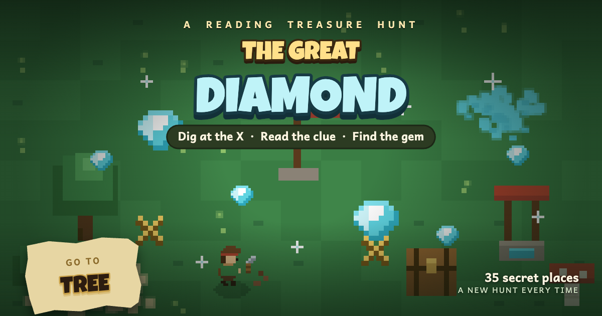

# The Great Diamond — Treasure Hunt

A tiny, mobile-friendly **reading treasure hunt** game — a playful adventure
made for **early readers**. Dig at the X, read the clue on the torn note, then
head to the next landmark — find all the gems and claim the great diamond! Big
friendly words, simple one-word clues, and chunky touch controls keep it
approachable for little hands and new readers. Built as a zero-dependency,
installable [PWA](https://web.dev/progressive-web-apps/) that runs fully
offline.

## Play

Open `index.html` in a browser, or serve the folder and visit it:

```bash
python3 -m http.server 8000
# then open http://localhost:8000
```

> A service worker is registered only over `http(s)` (not `file://`), so use a
> local server if you want offline/installable behaviour.

### Controls

| Action | Touch | Keyboard |
| ------ | ----- | -------- |
| Move   | On-screen joystick | Arrow keys |
| Dig    | **DIG** button | Space |
| Mute   | ♪ button | — |

Follow the **GO TO** target in the HUD to the matching landmark, dig to reveal
the next clue, and repeat until you uncover the diamond. Progress is saved to
`localStorage`, so you can close the tab and pick up where you left off.

## Project structure

| File | Purpose |
| ---- | ------- |
| `index.html` | Markup, styles, HUD, and boot script |
| `th-game.js` | Main game loop, state, input, persistence (`window.THG`) |
| `th-world.js` | World generation and terrain/landmark painting (`window.THW`) |
| `th-landmarks.js` | Landmark definitions and rendering |
| `th-sprites.js` | Pixel-art sprites incl. the diamond icon (`window.THS`) |
| `th-audio.js` | Sound effects and music (`window.THA`) |
| `sw.js` | Service worker for offline caching |
| `manifest.webmanifest` | PWA manifest (name, icons, theme) |
| `icons/` | Favicons and home-screen / maskable app icons |

No build step, no dependencies — plain HTML, CSS, and JavaScript.

## Install

On a phone, open the served page and use **Add to Home Screen**. The app
launches standalone and works without a connection once cached.
